# F1 Fantasy Optimizer Web Application

A web-based tool for optimizing F1 Fantasy team selections using Value For Money (VFM) calculations and track affinity analysis.

## Features

- **VFM Calculation**: Analyzes driver and constructor performance with outlier removal
- **Track Affinity Analysis**: Determines how well drivers/constructors perform at specific track types
- **Two-Step Optimization**: Optimizes team selection for the next two races
- **Risk Tolerance Settings**: Choose between consistent performers or track-specific optimization
- **Interactive Web Interface**: Easy-to-use web UI for configuration and results
- **Default Data Support**: Upload data once and reuse it for multiple optimizations
- **Configuration Memory**: Automatically remembers your last team configuration
- **Docker Support**: Fully containerized for easy deployment

## Optimisation Process

The optimiser runs in three main stages:

### 1. Value For Money (VFM) Calculation

Driver and constructor race results are cleaned using a standard deviation based
outlier filter before calculating a weighted average of points. Outliers more
than `outlier_stddev_factor` standard deviations from the mean are replaced with
`NaN`【F:f1_optimizer.py†L464-L481】. When using the trend‑based weighting scheme,
points are weighted according to the slope of recent performance. Improving
trends favour exponential weights while declining trends receive heavier decay
【F:f1_optimizer.py†L496-L517】. Other schemes (equal, linear, exponential and
moderate decay) compute fixed weights for all races【F:f1_optimizer.py†L557-L576】.

If FP2 lap data is available the optimiser queries the OpenF1 API, converts lap
times into pace scores and scales VFM values accordingly【F:f1_optimizer.py†L336-L410】.

### 2. Track Affinity Analysis

Historical race points are merged with circuit characteristics and cleansed with
an IQR‑based outlier detector that also uses rolling standard deviation to
dynamically tighten bounds【F:f1_optimizer.py†L667-L696】. Categorical track
features are label encoded before estimating how strongly each characteristic
correlates with past points. Importance weights are derived from the variance of
each characteristic【F:f1_optimizer.py†L718-L763】.

Correlations combine long and short term trends. Robust correlation metrics
(linear, quadratic and threshold based) are blended and weighted by bootstrap
confidence estimates to reduce noise【F:f1_optimizer.py†L765-L888】. Interaction
effects between pairs of characteristics further refine each driver or
constructor affinity, producing a score for every circuit【F:f1_optimizer.py†L890-L965】.

### 3. Two‑Step Team Optimisation

Team selection is optimised for the next two races. Track affinities adjust VFM
for each upcoming circuit and points are scaled by the selected driver boost
multiplier. Candidate swaps are generated from the top ranked drivers and
constructors while respecting the budget and maximum swap limits
【F:f1_optimizer.py†L1149-L1203】.

Each swap pattern is evaluated to maximise expected points per million of budget
and the search can optionally use an integer linear programming solver for exact
optimisation. Results for both steps are compared to the baseline team to report
the expected improvement.

### Optimisation Architecture

```mermaid
flowchart TD
    %% Styling
    classDef userInterface fill:#e1f5fe,stroke:#01579b,stroke-width:2px,color:#000
    classDef dataFiles fill:#f3e5f5,stroke:#4a148c,stroke-width:2px,color:#000
    classDef stage1 fill:#e8f5e8,stroke:#1b5e20,stroke-width:2px,color:#000
    classDef stage2 fill:#fff3e0,stroke:#e65100,stroke-width:2px,color:#000
    classDef stage3 fill:#fce4ec,stroke:#880e4f,stroke-width:2px,color:#000
    classDef api fill:#ffeb3b,stroke:#f57f17,stroke-width:3px,color:#000
    classDef output fill:#f1f8e9,stroke:#33691e,stroke-width:2px,color:#000

    %% Top Row: User Interface
    UI[📱 User Form<br/>index.html]:::userInterface
    STATS[📊 Statistics Page<br/>statistics.html]:::userInterface
    APP[⚙️ Flask App<br/>app.py /optimize]:::userInterface

    %% Second Row: Data Sources
    subgraph DATA ["📁 Data Sources"]
        direction LR
        D1[🏎️ driver_race_data.csv]:::dataFiles
        D2[🏭 constructor_race_data.csv]:::dataFiles
        C1[📅 calendar.csv]:::dataFiles
        T1[🏁 tracks.csv]:::dataFiles
        M[🔗 driver_mapping.csv]:::dataFiles
        S[⚙️ settings.json]:::dataFiles
    end

    %% External API
    API[🌐 OpenF1 API<br/>FP2 Pace Data]:::api

    %% Third Row: Stage 1 (highest priority)
    subgraph STAGE1 ["🎯 Stage 1: Value for Money (VFM)"]
        direction LR
        CLEAN1[🧹 Filter Outliers]:::stage1
        WEIGH[⚖️ Weight Points]:::stage1
        FP2[🏎️ Apply FP2 Pace]:::stage1
        VFMOUT[📤 VFM Output<br/>driver_vfm.csv<br/>constructor_vfm.csv]:::output
        
        CLEAN1 --> WEIGH --> FP2 --> VFMOUT
    end

    %% Fourth Row: Stage 2
    subgraph STAGE2 ["🎪 Stage 2: Track Affinity"]
        direction LR
        CLEAN2[🧹 Remove Outliers]:::stage2
        ENCODE[🔢 Encode Track Features]:::stage2
        CORR[🔗 Blend Correlations]:::stage2
        INTER[⚡ Interaction Effects]:::stage2
        AFFOUT[📤 Affinity Output<br/>driver_affinity.csv<br/>constructor_affinity.csv]:::output
        
        CLEAN2 --> ENCODE --> CORR --> INTER --> AFFOUT
    end

    %% Fifth Row: Stage 3 (lowest priority)
    subgraph STAGE3 ["🎯 Stage 3: Team Optimization"]
        direction LR
        PREP[📋 Apply Affinities & VFM]:::stage3
        CANDS[👥 Generate Candidates]:::stage3
        STEP1[🔄 Optimize Step 1]:::stage3
        STEP2[🔄 Optimize Step 2]:::stage3
        RESULT[🏆 Final Results<br/>optimization_*.json]:::output
        
        PREP --> CANDS --> STEP1 --> STEP2 --> RESULT
    end

    %% Vertical Flow Connections
    UI --> APP
    APP --> DATA
    DATA --> STAGE1
    STAGE1 --> STAGE2
    STAGE2 --> STAGE3
    RESULT --> STATS

    %% Data Dependencies
    API -.-> FP2
    D1 -.-> CLEAN1
    D2 -.-> CLEAN1
    D1 -.-> CLEAN2
    D2 -.-> CLEAN2
    T1 -.-> CLEAN2
    VFMOUT -.-> PREP
    AFFOUT -.-> PREP
    S -.-> PREP
```



## Prerequisites

- Docker and Docker Compose installed
- CSV data files:
  - `driver_race_data.csv`: Driver performance data
  - `constructor_race_data.csv`: Constructor performance data
  - `calendar.csv`: Race calendar with circuits
  - `tracks.csv`: Track characteristics

## Quick Start

1. **Clone or download the project files**

2. **Create the project structure**:
```bash
mkdir f1-optimizer
cd f1-optimizer

# Create directories
mkdir templates
mkdir default_data  # For storing default data files

# Save the provided files:
# - app.py (main Flask application)
# - f1_optimizer.py (optimization logic from the CLI version)
# - templates/index.html (web interface)
# - Dockerfile
# - docker-compose.yml
# - requirements.txt
```

3. **Prepare the f1_optimizer.py file**:
   
   Take the complete F1 optimizer code from the CLI version and save it as `f1_optimizer.py`, but remove the `main()` function and the `if __name__ == "__main__"` block at the end.

4. **Build and run with Docker Compose**:
```bash
docker-compose up --build
```

5. **Access the application**:
   
   Open your browser and go to `http://localhost:5000`

## Using the Application

### Initial Setup - Upload Default Data

1. **First Time Setup**:
   - Click on each file input to select your CSV files
   - Check "Save these files as default data"
   - Click "Upload New Files"
   - Your data is now saved and will persist between sessions

2. **Using Default Data**:
   - When you return to the app, click "Use Default Data"
   - Your previous configuration will be automatically loaded
   - You can immediately run optimizations without re-uploading files

### Running Optimizations

1. **Configure Your Team**:
   - Select your current 5 drivers and 2 constructors
   - Set your remaining budget
   - Choose swap limits for each step
   - Select weighting scheme and risk tolerance

2. **Run Optimization**:
   - Click "Run Optimization"
   - View recommended swaps for each race
   - See expected point improvements
   - Download full results as JSON

3. **Updating Data**:
   - To update default data, upload new files and check "Save these files as default data"
   - To use different data temporarily, upload files without checking the box

## Data File Formats

### driver_race_data.csv
```csv
Driver,Team,Cost,Race1,Race2,Race3,...
Max VERSTAPPEN,Red Bull,$30.5M,44,48,43,...
```

### constructor_race_data.csv
```csv
Constructor,Cost,Race1,Race2,Race3,...
Red Bull,$25.4M,73,78,73,...
```

### calendar.csv
```csv
Race,Grand Prix,Circuit
Race1,Bahrain Grand Prix,Bahrain International Circuit
Race2,Saudi Arabian Grand Prix,Jeddah Corniche Circuit
```

### tracks.csv
```csv
Grand Prix,Circuit,Corners,Length (km),Overtaking Opportunities,Track Speed,Expected Temperatures
Bahrain Grand Prix,Bahrain International Circuit,15,5.412,High,Medium,Hot
```

## Configuration Options

- **Weighting Scheme**: How to weight historical performance
  - Trend-based: Adaptive weights based on performance trends
  - Equal: All races weighted equally
  - Linear/Exponential decay: Recent races weighted more

- **Risk Tolerance**:
  - Low: Prioritizes consistent performers
  - Medium: Balanced approach
  - High: Prioritizes track-specific performance

## Optimisation Parameters

These advanced settings are loaded from `default_data/settings.json` and can be
adjusted on the Administration page.

- **outlier_stddev_factor** – Number of standard deviations used to filter
  outlier race results. Increase this value to keep more data and smooth
  performance trends. Decrease it to remove anomalies and focus on typical
  results.
- **trend_slope_threshold** – Minimum slope for the trend-based weighting to
  treat a driver or constructor as improving or declining. Higher values make
  the algorithm less sensitive to short-term swings, while lower values react
  more quickly.
- **recent_races_fraction** – Fraction of all races considered "recent" when
  blending long-term and short-term correlations. A larger fraction incorporates
  more races, whereas a smaller fraction focuses on the latest events.
- **long_term_weight** – Proportion of long-term correlation in the blended
  score. Increase to rely more on season-long form; decrease to emphasize recent
  results.
- **interaction_weight** – Weight applied to track interaction correlations.
  Raising this value makes driver/constructor-track affinities more influential
  in the final optimisation, while lowering it reduces that effect.

## Data Persistence

The application supports three types of data persistence:

1. **Default Data**: CSV files stored in `default_data/` directory
   - Persists across Docker container restarts
   - Shared across all optimization sessions
   - Updated only when explicitly requested

2. **Configuration Memory**: Last used team configuration
   - Automatically saved after each optimization
   - Loaded when using default data

3. **Results History**: All optimization results
   - Saved in `results/` directory
   - Each result has a unique timestamp
   - Can be downloaded as JSON

## Development

### Running without Docker

1. Install Python 3.9+
2. Install dependencies: `pip install -r requirements.txt`
3. Run the app: `python app.py`

### File Structure
```
f1-optimizer/
├── app.py                 # Flask web application
├── f1_optimizer.py        # Core optimization logic
├── templates/
│   └── index.html        # Web interface
├── uploads/              # Temporary uploaded files
├── results/              # Optimization results
├── default_data/         # Default CSV files (persisted)
├── Dockerfile
├── docker-compose.yml
├── requirements.txt
└── README.md
```

## Environment Variables

- `FLASK_SECRET_KEY`: Secret key for Flask sessions (default: auto-generated)
- `FLASK_ENV`: Flask environment (production/development)

## Troubleshooting

- **Port already in use**: Change the port in docker-compose.yml and app.py
- **File upload errors**: Ensure CSV files are properly formatted
- **Default data not loading**: Check that files exist in `default_data/` directory
- **Optimization errors**: Check that driver/constructor names match exactly between files
- **Memory issues**: For large datasets, increase Docker memory allocation

## Security Notes

- This is designed for local/private use
- No authentication is implemented
- Uploaded files are stored locally
- Consider adding authentication for public deployment

## License

This project is provided as-is for educational and personal use.
